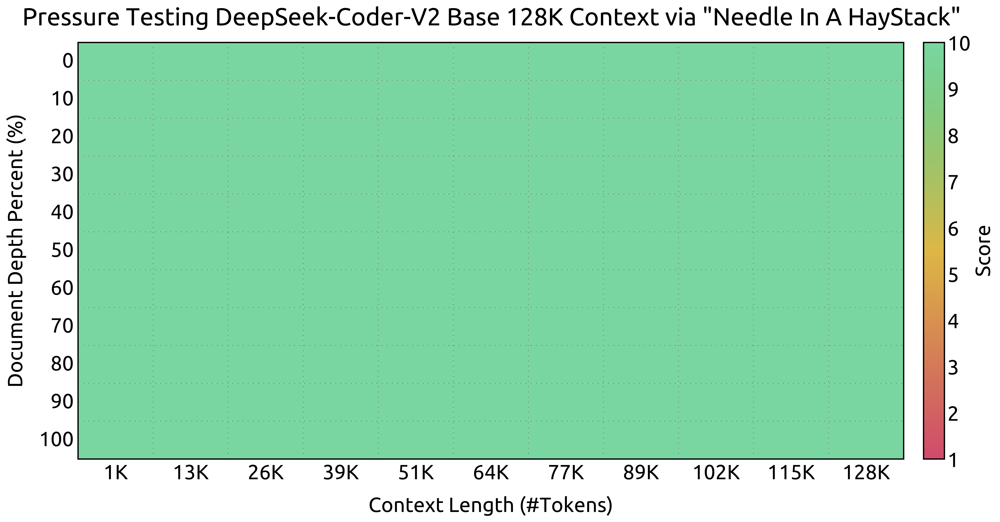
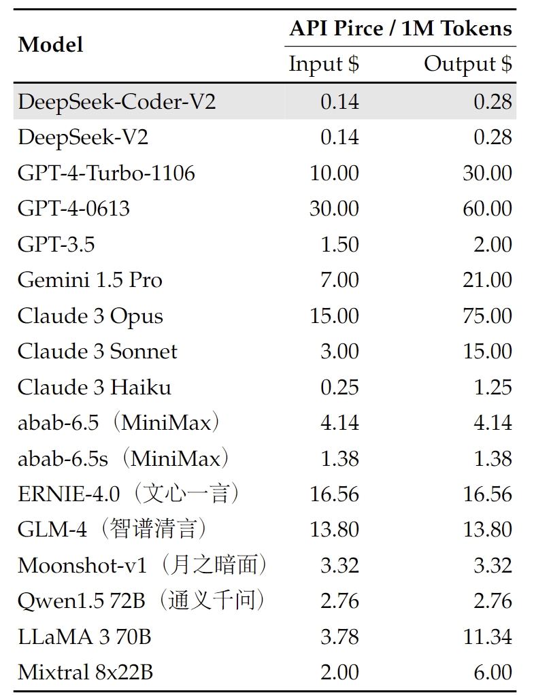

<!-- markdownlint-disable first-line-h1 -->
<!-- markdownlint-disable html -->
<!-- markdownlint-disable no-duplicate-header -->

<div align="center">
  
</div>
<hr>
<div align="center" style="line-height: 1;">
  <a href="https://www.deepseek.com/" target="_blank" style="margin: 2px;">
    
  </a>
  <a href="https://chat.deepseek.com/" target="_blank" style="margin: 2px;">
    
  </a>
  <a href="https://huggingface.co/deepseek-ai" target="_blank" style="margin: 2px;">
    
  </a>
</div>

<div align="center" style="line-height: 1;">
  <a href="https://discord.gg/Tc7c45Zzu5" target="_blank" style="margin: 2px;">
    
  </a>
  <a href="https://github.com/deepseek-ai/DeepSeek-V2/blob/main/figures/qr.jpeg?raw=true" target="_blank" style="margin: 2px;">
    
  </a>
  <a href="https://twitter.com/deepseek_ai" target="_blank" style="margin: 2px;">
    
  </a>
</div>
<div align="center" style="line-height: 1;">
  <a href="https://github.com/deepseek-ai/DeepSeek-V2/blob/main/LICENSE-CODE" style="margin: 2px;">
    
  </a>
  <a href="https://github.com/deepseek-ai/DeepSeek-V2/blob/main/LICENSE-MODEL" style="margin: 2px;">
    
  </a>
</div>
<p align="center">
  <a href="#2-model-downloads">Model Download</a> |
  <a href="#3-evaluation-results">Evaluation Results</a> |
  <a href="#5-api-platform">API Platform</a> |
  <a href="#6-how-to-run-locally">How to Use</a> |
  <a href="#7-license">License</a> |
  <a href="#8-citation">Citation</a>
</p>


<p align="center">
  <a href="https://arxiv.org/pdf/2406.11931"><b>Paper Link</b>👁️</a>
</p>


# DeepSeek-Coder-V2: Breaking the Barrier of Closed-Source Models in Code Intelligence

## 1. Introduction
We present DeepSeek-Coder-V2, an open-source Mixture-of-Experts (MoE) code language model that achieves performance comparable to GPT4-Turbo in code-specific tasks. Specifically, DeepSeek-Coder-V2 is further pre-trained from an intermediate checkpoint of DeepSeek-V2 with additional 6 trillion tokens. Through this continued pre-training, DeepSeek-Coder-V2 substantially enhances the coding and mathematical reasoning capabilities of DeepSeek-V2, while maintaining comparable performance in general language tasks. Compared to DeepSeek-Coder-33B, DeepSeek-Coder-V2 demonstrates significant advancements in various aspects of code-related tasks, as well as reasoning and general capabilities. Additionally, DeepSeek-Coder-V2 expands its support for programming languages from 86 to 338, while extending the context length from 16K to 128K. 

<p align="center">
  
</p>


In standard benchmark evaluations, DeepSeek-Coder-V2 achieves superior performance compared to closed-source models such as GPT4-Turbo, Claude 3 Opus, and Gemini 1.5 Pro in coding and math benchmarks.  The list of supported programming languages can be found [here](supported_langs.txt).

## 2. Model Downloads

We release the DeepSeek-Coder-V2 with 16B and 236B parameters based on the [DeepSeekMoE](https://arxiv.org/pdf/2401.06066) framework, which has actived parameters of only 2.4B and 21B , including base and instruct models, to the public. 

<div align="center">

|            **Model**            | **#Total Params** | **#Active Params** | **Context Length** |                         **Download**                         |
| :-----------------------------: | :---------------: | :----------------: | :----------------: | :----------------------------------------------------------: |
|   DeepSeek-Coder-V2-Lite-Base   |        16B        |        2.4B        |        128k        | [🤗 HuggingFace](https://huggingface.co/deepseek-ai/DeepSeek-Coder-V2-Lite-Base) |
| DeepSeek-Coder-V2-Lite-Instruct |        16B        |        2.4B        |        128k        | [🤗 HuggingFace](https://huggingface.co/deepseek-ai/DeepSeek-Coder-V2-Lite-Instruct) |
|     DeepSeek-Coder-V2-Base      |       236B        |        21B         |        128k        | [🤗 HuggingFace](https://huggingface.co/deepseek-ai/DeepSeek-Coder-V2-Base) |
|   DeepSeek-Coder-V2-Instruct    |       236B        |        21B         |        128k        | [🤗 HuggingFace](https://huggingface.co/deepseek-ai/DeepSeek-Coder-V2-Instruct) |

</div>


## 3. Evaluation Results
### 3.1 Code Generation


|  | #TP | #AP | HumanEval | MBPP+ | LiveCodeBench | USACO |
|:------------|:--------:|:--------:|:--------:|:--------:|:--------:|:-----------:|
| **Closed-Source Models** |  |  |  |  |  |  |
| **Gemini-1.5-Pro**                  |  -   |  -   |   83.5    | **74.6**  |   34.1   |   4.9    |
| **Claude-3-Opus**                   |  -   |  -   |   84.2    |   72.0    |   34.6   |   7.8    |
| **GPT-4-Turbo-1106**                |  -   |  -   |   87.8    |   69.3    |   37.1   |   11.1   |
| **GPT-4-Turbo-0409**                |  -   |  -   |   88.2    |   72.2    | **45.7** |   12.3   |
| **GPT-4o-0513**                     |  -   |  -   | **91.0** |   73.5    |   43.4   | **18.8** |
| **Open-Source Models**              |      |      |           |           |          |          |
| **CodeStral**                       | 22B  | 22B  |   78.1    |   68.2    |   31.0   |   4.6    |
| **DeepSeek-Coder-Instruct**         | 33B  | 33B  |   79.3    |   70.1   |   22.5   |   4.2    |
| **Llama3-Instruct**                 | 70B  | 70B  |   81.1    |   68.8   |   28.7   |   3.3    |
| **DeepSeek-Coder-V2-Lite-Instruct** | 16B | 2.4B | 81.1 | 68.8 | 24.3 | 6.5 |
| **DeepSeek-Coder-V2-Instruct** | 236B | 21B  | **90.2** | **76.2** | **43.4** | **12.1** |

### 3.2 Code Completion


| Model                           | #TP  | #AP  | RepoBench (Python) | RepoBench (Java) | HumanEval FIM |
| :------------------------------ | :--: | :--: | :----------------: | :--------------: | :-----------: |
| **CodeStral**                   | 22B  | 22B  |      **46.1**      |     **45.7**     |     83.0      |
| **DeepSeek-Coder-Base**         |  7B  |  7B  |        36.2        |       43.3       |     86.1      |
| **DeepSeek-Coder-Base**         | 33B  | 33B  |        39.1        |       44.8       |   **86.4**    |
| **DeepSeek-Coder-V2-Lite-Base** | 16B  | 2.4B |        38.9        |       43.3       |   **86.4**    |

### 3.3 Code Fixing


|                                     | #TP  | #AP  | Defects4J | SWE-Bench |  Aider   |
| ----------------------------------- | :--: | :--: | :-------: | :-------: | :------: |
| **Closed-Source Models**            |      |      |           |           |          |
| **Gemini-1.5-Pro**                  |  -   |  -   |   18.6    |   19.3    |   57.1   |
| **Claude-3-Opus**                   |  -   |  -   |   25.5    |   11.7    |   68.4   |
| **GPT-4-Turbo-1106**                |  -   |  -   |   22.8    |   22.7    |   65.4   |
| **GPT-4-Turbo-0409**                |  -   |  -   |   24.3    |   18.3    |   63.9   |
| **GPT-4o-0513**                     |  -   |  -   | **26.1**  | **26.7**  | **72.9** |
| **Open-Source Models**              |      |      |           |           |          |
| **CodeStral**                       | 22B  | 22B  |   17.8    |    2.7    |   51.1   |
| **DeepSeek-Coder-Instruct**         | 33B  | 33B  |   11.3    |    0.0    |   54.5   |
| **Llama3-Instruct**                 | 70B  | 70B  |   16.2    |     -     |   49.2   |
| **DeepSeek-Coder-V2-Lite-Instruct** | 16B  | 2.4B |    9.2    |    0.0    |   44.4   |
| **DeepSeek-Coder-V2-Instruct**      | 236B | 21B  | **21.0**  | **12.7**  | **73.7** |

### 3.4 Mathematical Reasoning


|                                     | #TP  | #AP  |  GSM8K   |   MATH   | AIME 2024 | Math Odyssey |
| ----------------------------------- | :--: | :--: | :------: | :------: | :-------: | :----------: |
| **Closed-Source Models**            |      |      |          |          |           |              |
| **Gemini-1.5-Pro**                  |  -   |  -   |   90.8   |   67.7   |   2/30    |     45.0     |
| **Claude-3-Opus**                   |  -   |  -   |   95.0   |   60.1   |   2/30    |     40.6     |
| **GPT-4-Turbo-1106**                |  -   |  -   |   91.4   |   64.3   |   1/30    |     49.1     |
| **GPT-4-Turbo-0409**                |  -   |  -   |   93.7   |   73.4   | **3/30**  |     46.8     |
| **GPT-4o-0513**                     |  -   |  -   | **95.8** | **76.6** |   2/30    |   **53.2**   |
| **Open-Source Models**              |      |      |          |          |           |              |
| **Llama3-Instruct**                 | 70B  | 70B  |   93.0   |   50.4   |   1/30    |     27.9     |
| **DeepSeek-Coder-V2-Lite-Instruct** | 16B  | 2.4B |   86.4   |   61.8   |   0/30    |     44.4     |
| **DeepSeek-Coder-V2-Instruct**      | 236B | 21B  | **94.9** | **75.7** | **4/30**  |   **53.7**   |

### 3.5 General Natural Language

|      Benchmark       | Domain  | DeepSeek-V2-Lite Chat | DeepSeek-Coder-V2-Lite Instruct | DeepSeek-V2 Chat | DeepSeek-Coder-V2 Instruct |
| :------------------: | :-----: | :-------------------: | :-----------------------------: | :--------------: | :------------------------: |
|       **BBH**        | English |         48.1          |              61.2               |       79.7       |          **83.9**          |
|       **MMLU**       | English |         55.7          |              60.1               |       78.1       |          **79.2**          |
|     **ARC-Easy**     | English |         86.1          |              88.9               |     **98.1**     |            97.4            |
|  **ARC-Challenge**   | English |         73.4          |              77.4               |       92.3       |          **92.8**          |
|     **TriviaQA**     | English |         65.2          |              59.5               |     **86.7**     |            82.3            |
| **NaturalQuestions** | English |         35.5          |              30.8               |     **53.4**     |            47.5            |
|     **AGIEval**      | English |         42.8          |              28.7               |     **61.4**     |             60             |
|     **CLUEWSC**      | Chinese |         80.0          |              76.5               |     **89.9**     |            85.9            |
|      **C-Eval**      | Chinese |         60.1          |              61.6               |       78.0       |          **79.4**          |
|      **CMMLU**       | Chinese |         62.5          |              62.7               |     **81.6**     |            80.9            |
|    **Arena-Hard**    |    -    |         11.4          |              38.1               |       41.6       |          **65.0**          |
|  **AlpaceEval 2.0**  |    -    |         16.9          |              17.7               |     **38.9**     |            36.9            |
|     **MT-Bench**     |    -    |         7.37          |              7.81               |     **8.97**     |            8.77            |
|    **Alignbench**    |    -    |         6.02          |              6.83               |     **7.91**     |            7.84            |

### 3.6 Context Window

<p align="center">
  
</p>


Evaluation results on the ``Needle In A Haystack`` (NIAH) tests.  DeepSeek-Coder-V2 performs well across all context window lengths up to **128K**. 

## 4. Chat Website

You can chat with the DeepSeek-Coder-V2 on DeepSeek's official website: [coder.deepseek.com](https://coder.deepseek.com/sign_in)

## 5. API Platform
We also provide OpenAI-Compatible API at DeepSeek Platform: [platform.deepseek.com](https://platform.deepseek.com/), and you can also pay-as-you-go at an unbeatable price.

<p align="center">
  
</p>


## 6. How to run locally
**Here, we provide some examples of how to use DeepSeek-Coder-V2-Lite model. If you want to utilize DeepSeek-Coder-V2 in BF16 format for inference, 80GB*8 GPUs are required.**

### Inference with Huggingface's Transformers
You can directly employ [Huggingface's Transformers](https://github.com/huggingface/transformers) for model inference.

#### Code Completion
```python
from transformers import AutoTokenizer, AutoModelForCausalLM
import torch
tokenizer = AutoTokenizer.from_pretrained("deepseek-ai/DeepSeek-Coder-V2-Lite-Base", trust_remote_code=True)
model = AutoModelForCausalLM.from_pretrained("deepseek-ai/DeepSeek-Coder-V2-Lite-Base", trust_remote_code=True, torch_dtype=torch.bfloat16).cuda()
input_text = "#write a quick sort algorithm"
inputs = tokenizer(input_text, return_tensors="pt").to(model.device)
outputs = model.generate(**inputs, max_length=128)
print(tokenizer.decode(outputs[0], skip_special_tokens=True))
```

#### Code Insertion
```python
from transformers import AutoTokenizer, AutoModelForCausalLM
import torch
tokenizer = AutoTokenizer.from_pretrained("deepseek-ai/DeepSeek-Coder-V2-Lite-Base", trust_remote_code=True)
model = AutoModelForCausalLM.from_pretrained("deepseek-ai/DeepSeek-Coder-V2-Lite-Base", trust_remote_code=True, torch_dtype=torch.bfloat16).cuda()
input_text = """<｜fim▁begin｜>def quick_sort(arr):
    if len(arr) <= 1:
        return arr
    pivot = arr[0]
    left = []
    right = []
<｜fim▁hole｜>
        if arr[i] < pivot:
            left.append(arr[i])
        else:
            right.append(arr[i])
    return quick_sort(left) + [pivot] + quick_sort(right)<｜fim▁end｜>"""
inputs = tokenizer(input_text, return_tensors="pt").to(model.device)
outputs = model.generate(**inputs, max_length=128)
print(tokenizer.decode(outputs[0], skip_special_tokens=True)[len(input_text):])
```

#### Chat Completion

```python
from transformers import AutoTokenizer, AutoModelForCausalLM
import torch
tokenizer = AutoTokenizer.from_pretrained("deepseek-ai/DeepSeek-Coder-V2-Lite-Instruct", trust_remote_code=True)
model = AutoModelForCausalLM.from_pretrained("deepseek-ai/DeepSeek-Coder-V2-Lite-Instruct", trust_remote_code=True, torch_dtype=torch.bfloat16).cuda()
messages=[
    { 'role': 'user', 'content': "write a quick sort algorithm in python."}
]
inputs = tokenizer.apply_chat_template(messages, add_generation_prompt=True, return_tensors="pt").to(model.device)
# tokenizer.eos_token_id is the id of <｜end▁of▁sentence｜> token
outputs = model.generate(inputs, max_new_tokens=512, do_sample=False, top_k=50, top_p=0.95, num_return_sequences=1, eos_token_id=tokenizer.eos_token_id)
print(tokenizer.decode(outputs[0][len(inputs[0]):], skip_special_tokens=True))
```


The complete chat template can be found within `tokenizer_config.json` located in the huggingface model repository.

An example of chat template is as belows:

```bash
<｜begin▁of▁sentence｜>User: {user_message_1}

Assistant: {assistant_message_1}<｜end▁of▁sentence｜>User: {user_message_2}

Assistant:
```

You can also add an optional system message:

```bash
<｜begin▁of▁sentence｜>{system_message}

User: {user_message_1}

Assistant: {assistant_message_1}<｜end▁of▁sentence｜>User: {user_message_2}

Assistant:
```

In the last round of dialogue, note that "Assistant:" has no space after the colon. Adding a space might cause the following issues on the 16B-Lite model:
- English questions receiving Chinese responses.
- Responses containing garbled text.
- Responses repeating excessively.

Older versions of Ollama had this bug (see https://github.com/deepseek-ai/DeepSeek-Coder-V2/issues/12), but it has been fixed in the latest version.


### Inference with SGLang (recommended)
[SGLang](https://github.com/sgl-project/sglang) currently supports MLA optimizations, FP8 (W8A8), FP8 KV Cache, and Torch Compile, offering the best latency and throughput among open-source frameworks. Here are some example commands to launch an OpenAI API-compatible server:

```bash
# BF16, tensor parallelism = 8
python3 -m sglang.launch_server --model deepseek-ai/DeepSeek-Coder-V2-Instruct --tp 8 --trust-remote-code

# BF16, w/ torch.compile (The compilation can take several minutes)
python3 -m sglang.launch_server --model deepseek-ai/DeepSeek-Coder-V2-Lite-Instruct --trust-remote-code --enable-torch-compile

# FP8, tensor parallelism = 8, FP8 KV cache
python3 -m sglang.launch_server --model neuralmagic/DeepSeek-Coder-V2-Instruct-FP8 --tp 8 --trust-remote-code --kv-cache-dtype fp8_e5m2
```

After launching the server, you can query it with OpenAI API

```
import openai
client = openai.Client(
    base_url="http://127.0.0.1:30000/v1", api_key="EMPTY")

# Chat completion
response = client.chat.completions.create(
    model="default",
    messages=[
        {"role": "system", "content": "You are a helpful AI assistant"},
        {"role": "user", "content": "List 3 countries and their capitals."},
    ],
    temperature=0,
    max_tokens=64,
)
print(response)
```


### Inference with vLLM (recommended)
To utilize [vLLM](https://github.com/vllm-project/vllm) for model inference, please merge this Pull Request into your vLLM codebase: https://github.com/vllm-project/vllm/pull/4650.

```python
from transformers import AutoTokenizer
from vllm import LLM, SamplingParams

max_model_len, tp_size = 8192, 1
model_name = "deepseek-ai/DeepSeek-Coder-V2-Lite-Instruct"
tokenizer = AutoTokenizer.from_pretrained(model_name)
llm = LLM(model=model_name, tensor_parallel_size=tp_size, max_model_len=max_model_len, trust_remote_code=True, enforce_eager=True)
sampling_params = SamplingParams(temperature=0.3, max_tokens=256, stop_token_ids=[tokenizer.eos_token_id])

messages_list = [
    [{"role": "user", "content": "Who are you?"}],
    [{"role": "user", "content": "write a quick sort algorithm in python."}],
    [{"role": "user", "content": "Write a piece of quicksort code in C++."}],
]

prompt_token_ids = [tokenizer.apply_chat_template(messages, add_generation_prompt=True) for messages in messages_list]

outputs = llm.generate(prompt_token_ids=prompt_token_ids, sampling_params=sampling_params)

generated_text = [output.outputs[0].text for output in outputs]
print(generated_text)
```


## 7. License

This code repository is licensed under [the MIT License](LICENSE-CODE). The use of DeepSeek-Coder-V2 Base/Instruct models is subject to [the Model License](LICENSE-MODEL). DeepSeek-Coder-V2 series (including Base and Instruct) supports commercial use.

## 8. Citation
```latex
@article{zhu2024deepseek,
  title={DeepSeek-Coder-V2: Breaking the Barrier of Closed-Source Models in Code Intelligence},
  author={Zhu, Qihao and Guo, Daya and Shao, Zhihong and Yang, Dejian and Wang, Peiyi and Xu, Runxin and Wu, Y and Li, Yukun and Gao, Huazuo and Ma, Shirong and others},
  journal={arXiv preprint arXiv:2406.11931},
  year={2024}
}
```

## 9. Contact
If you have any questions, please raise an issue or contact us at [service@deepseek.com](service@deepseek.com).
